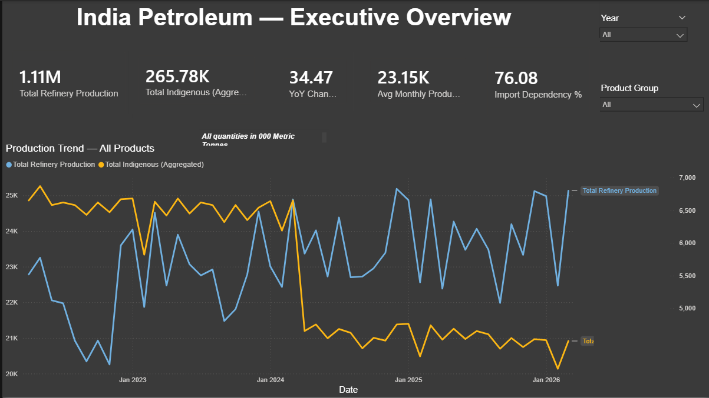
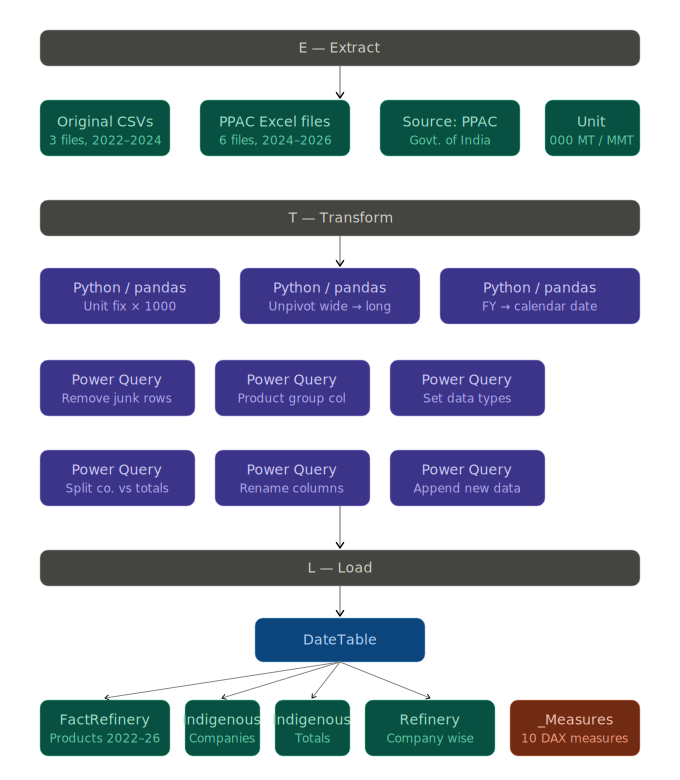

# India Petroleum Dashboard — Power BI

> An end-to-end data analytics project built on government petroleum data published by the **Petroleum Planning & Analysis Cell (PPAC), Ministry of Petroleum & Natural Gas, Government of India.**

---

## Table of Contents

- [Project Overview](#project-overview)
- [Key Insights](#key-insights)
- [Dashboard Pages](#dashboard-pages)
- [Data Sources](#data-sources)
- [ETL Pipeline](#etl-pipeline)
- [Data Model](#data-model)
- [DAX Measures](#dax-measures)
- [Challenges & Solutions](#challenges--solutions)
- [Directory Structure](#directory-structure)
- [Tools Used](#tools-used)

---

## Project Overview

This project builds a multi-page interactive Power BI dashboard analyzing India's petroleum sector from **April 2022 to March 2026**, covering:

- Monthly refinery production of petroleum products
- Indigenous (domestic) crude oil production by company
- Refinery-wise crude oil processing by oil company
- Year-over-Year and Month-over-Month production trends
- India's import dependency on crude oil

The dashboard is designed to serve as a **government-level analytical tool** for policymakers, researchers, and energy sector analysts.

---

## Key Insights

| Insight | Value |
|---|---|
| Total Refinery Production (2022–2026) | ~1.11 Million (000 MT) |
| Average Monthly Production | ~23.15K (000 MT) |
| YoY Production Growth | ~34.47% |
| Import Dependency | ~89–99% |
| Refinery output growth (Apr 2022 → Mar 2026) | ~22K → ~25K (000 MT/month) |

**Critical finding:** India imports approximately 89–99% of its crude oil needs. While refinery infrastructure is growing steadily, domestic crude production remains stagnant — making India highly vulnerable to global oil price shocks and geopolitical disruptions.

**Notable anomaly:** Indigenous production crashed to its lowest point in **January 2023** — likely a major supply disruption or planned maintenance shutdown — visible as a sharp dip in the trend line.

**Seasonal pattern:** Refinery output consistently dips around **October–November** every year and peaks around **April–May**, suggesting demand-driven cycles tied to agricultural and festival seasons.

---

## Dashboard Pages

### Page 1 — Executive Overview
High-level snapshot for leadership and policymakers.

- 5 KPI cards: Total Refinery Production, Total Indigenous Production, YoY Change %, Avg Monthly Production, Import Dependency %
- Dual-axis line chart: Refinery output vs Indigenous production (Apr 2022 → Mar 2026)
- Slicers: Year, Product Group



### Page 2 — Product Mix Analysis *(in progress)*
Which petroleum products dominate India's output.

- Donut chart: Product share %
- Clustered bar chart: Volume by product group
- Year-wise matrix with conditional formatting

### Page 3 — Indigenous Production *(planned)*
Company-wise domestic crude oil breakdown.

- Stacked area chart: ONGC, OIL, JVC/Private over time
- 100% stacked bar: Company share per year
- Import dependency gap line

### Page 4 — Seasonality & Trends *(planned)*
Monthly patterns and seasonal cycles.

- Heat map matrix: Month vs Year
- Small multiples by product
- Waterfall chart: MoM change

---

## Data Sources

All data sourced from **PPAC (Petroleum Planning & Analysis Cell)**, Government of India.

| File | Period | Description | Unit |
|---|---|---|---|
| `Monthly_Crude_Oil_Processed_by_Refineries.csv` | Apr 2022 – Mar 2024 | Product-wise refinery output | 000 MT |
| `Monthly_Indigenous_Crude_Oil_Production.csv` | Apr 2022 – Mar 2024 | Company-wise domestic crude | Million MT |
| `Monthly_Production_of_Petroleum_Products_by_Refineries_Fractionators.csv` | Apr 2022 – Mar 2024 | Petroleum products (confirmed identical to above) | 000 MT |
| `2024-2025_Crude_Oil_Processed_by_Refineries.xlsx` | Apr 2024 – Mar 2025 | Refinery-wise crude processed | 000 MT |
| `2025-2026_Crude_Oil_Processed_by_Refineries.xlsx` | Apr 2025 – Mar 2026 | Refinery-wise crude processed | 000 MT |
| `2024-2025_INDIGENOUS_CRUDE_OIL_PRODUCTION.xlsx` | Apr 2024 – Mar 2025 | Company-wise domestic crude | Million MT |
| `2025-2026_INDIGENOUS_CRUDE_OIL_PRODUCTION.xlsx` | Apr 2025 – Mar 2026 | Company-wise domestic crude | Million MT |
| `2024-205_Production_of_Petroleum_Products_by_Refineries_Fractionators.xlsx` | Apr 2024 – Mar 2025 | Product-wise refinery output | 000 MT |
| `2025-2026_Production_of_Petroleum_Products_by_Refineries_Fractionators.xlsx` | Apr 2025 – Mar 2026 | Product-wise refinery output | 000 MT |

---

## ETL Pipeline

```
┌─────────────────────────────────────────────────┐
│                  E — EXTRACT                    │
│                                                 │
│  Original CSVs        PPAC Excel Files          │
│  (3 files,            (6 files,                 │
│   2022–2024)           2024–2026)               │
│                                                 │
│  Source: PPAC, Govt of India                    │
│  Units: 000 MT (refinery) / MMT (indigenous)    │
└────────────────────────┬────────────────────────┘
                         │
                         ▼
┌─────────────────────────────────────────────────┐
│                T — TRANSFORM                    │
│                                                 │
│  Python / pandas:                               │
│  • Unit conversion: MMT × 1000 → 000 MT         │
│  • Unpivot: wide format → long format           │
│  • FY label → calendar date (APR=month 4 etc.) │
│  • Remove junk rows (logos, totals, notes)      │
│  • Standardize company names                    │
│  • Output: 4 clean CSV files                    │
│                                                 │
│  Power Query (inside Power BI):                 │
│  • Add Product Group column (conditional)       │
│  • Split aggregate rows vs company rows         │
│  • Rename columns (DAX-friendly, no spaces)     │
│  • Set data types (Date, Decimal, Text)         │
│  • Append new data to existing tables           │
│  • Create Date column from Month + Year         │
└────────────────────────┬────────────────────────┘
                         │
                         ▼
┌─────────────────────────────────────────────────┐
│                  L — LOAD                       │
│                                                 │
│  Star Schema in Power BI:                       │
│                                                 │
│              [ DateTable ]                      │
│             /      |      \      \              │
│     FactRefinery   │   Indigenous  Refinery     │
│                    │   Companies   CompanyWise  │
│              Indigenous                         │
│               Totals                            │
│                                                 │
│  + _Measures table (10 DAX measures)            │
└─────────────────────────────────────────────────┘
```



---

## Data Model

Star schema with one date dimension and four fact tables.

| Table | Type | Rows | Description |
|---|---|---|---|
| `DateTable` | Dimension | ~1,461 | Calendar Apr 2022 → Mar 2026 |
| `FactRefinery` | Fact | ~720 | Product-wise refinery output |
| `IndigenousProduction_Companies_FINAL` | Fact | ~192 | Company-wise crude production |
| `IndigenousProduction_Totals_FINAL` | Fact | ~120 | Aggregate crude totals |
| `FactRefineryCompanyWise` | Fact | ~504 | Refinery-wise crude processed |
| `_Measures` | Measures | — | All DAX calculations |

All fact tables connect to `DateTable[Date]` via Many-to-One relationships with Single cross-filter direction.


---

## DAX Measures

```dax
Total Refinery Production =
SUM(FactRefinery[Quantity_000MT])

Total Indigenous Production =
SUM(IndigenousProduction_Companies_FINAL[Quantity_000MT])

Total Indigenous (Aggregated) =
CALCULATE(
    SUM(IndigenousProduction_Totals_FINAL[Quantity_000MT]),
    IndigenousProduction_Totals_FINAL[Company Name] = "Total ( Crude oil + Condensate)"
)

Import Dependency % =
DIVIDE(
    [Total Refinery Production] - [Total Indigenous (Aggregated)],
    [Total Refinery Production], 0
) * 100

Avg Monthly Production =
AVERAGEX(VALUES(DateTable[Year-Month]), [Total Refinery Production])

Production Last Year =
CALCULATE([Total Refinery Production], SAMEPERIODLASTYEAR(DateTable[Date]))

YoY Change % =
DIVIDE([Total Refinery Production] - [Production Last Year], [Production Last Year], 0) * 100

MoM Change % =
VAR CurrentMonth = [Total Refinery Production]
VAR PrevMonth = CALCULATE([Total Refinery Production], DATEADD(DateTable[Date], -1, MONTH))
RETURN DIVIDE(CurrentMonth - PrevMonth, PrevMonth, 0) * 100

Production YTD =
CALCULATE([Total Refinery Production], DATESYTD(DateTable[Date]))

Product Share % =
DIVIDE(
    SUM(FactRefinery[Quantity_000MT]),
    CALCULATE(SUM(FactRefinery[Quantity_000MT]), ALL(FactRefinery[Product Group])), 0
) * 100

Chart Title =
"Production Trend — " &
IF(ISFILTERED(FactRefinery[Product Group]),
   SELECTEDVALUE(FactRefinery[Product Group], "Multiple Products"),
   "All Products")
```

---

## Challenges & Solutions

### Challenge 1 — Duplicate source files
**Problem:** `Monthly_Crude_Oil_Processed_by_Refineries.csv` and `Monthly_Production_of_Petroleum_Products_by_Refineries_Fractionators.csv` appeared identical from preview.

**Solution:** Performed a Left Anti Join merge in Power Query on Date + Products + Quantity. Result: 0 of 360 rows returned — confirmed 100% identical. Deleted one, kept the other as `FactRefinery`.

---

### Challenge 2 — Unit mismatch across years (most critical)
**Problem:** The original `Monthly_Indigenous_Crude_Oil_Production.csv` stored values in **Million Metric Tonnes** (e.g. 2.26) while the column header claimed "000 Metric Tonnes". New PPAC files also used Million MT for indigenous data. This caused a sudden jump in the indigenous production line chart at Jan 2024 — from ~20 (raw MMT) to ~2,300 (correctly converted 000 MT).

**Solution:** Rebuilt both indigenous tables from scratch using Python/pandas — multiplying all original CSV values by 1000, and applying the same conversion to new PPAC files during processing. The fixed files (`IndigenousProduction_Companies_FINAL.csv`, `IndigenousProduction_Totals_FINAL.csv`) replaced all previous attempts.

**Lesson:** Always verify units at source, not just column names. Government datasets frequently mix reporting units across years.

---

### Challenge 3 — Wide format vs long format
**Problem:** All new PPAC Excel files stored months as columns (APR, MAY, JUN...) — a wide format that Power BI cannot use for time-series analysis.

**Solution:** Used Python/pandas to unpivot month columns into rows, map each month abbreviation to its calendar month name and number, and convert fiscal year labels (2024-25) into actual calendar year values (APR–DEC = 2024, JAN–MAR = 2025).

---

### Challenge 4 — Aggregate rows mixed with data rows
**Problem:** `Monthly_Indigenous_Crude_Oil_Production.csv` mixed individual company rows (ONGC, OIL, JVC/Private) with aggregate rows (Total crude oil, Total Crude oil + Condensate, PSU total) in the same column. Summing all rows would double or triple count.

**Solution:** Split into two separate tables in Power Query using Text Filters — one containing company rows only, one containing total rows only. The DAX measure `Total Indigenous (Aggregated)` then filters specifically to "Total (Crude oil + Condensate)" to avoid double counting within the totals table.

---

### Challenge 5 — Inconsistent product naming
**Problem:** The same product appeared under multiple names: HSD-VI, HSD Others; MS-VI, MS Others — making product-level aggregation impossible.

**Solution:** Added a `Product Group` column using a conditional Power Query formula mapping all variants to a clean group name (HSD-VI + HSD Others → "HSD", MS-VI + MS Others → "MS / Petrol", etc.) covering all 13 product types found in the data.

---

### Challenge 6 — X-axis sort order
**Problem:** The `Year-Month` column (formatted as "2023-04") is a text field. Power BI sorted it alphabetically (2022-11 before 2022-09) instead of chronologically.

**Solution:** Replaced `Year-Month` on the X-axis with the actual `DateTable[Date]` column, which Power BI natively sorts chronologically and provides free drill-down hierarchy (Year → Quarter → Month).

---

### Challenge 7 — Power Query step ordering
**Problem:** Adding custom columns in Power Query failed with "column not recognized" errors because the column rename step had not yet run at the point where the custom column was being inserted.

**Solution:** Always insert custom columns **after** the last Applied Step in Power Query — at that point all renames have occurred and column names are final.

---

## Directory Structure

```
india-petroleum-dashboard/
│
├── README.md                          ← This file
│
├── data/
│   ├── raw/
│   │   ├── original_csvs/
│   │   │   ├── Monthly_Crude_Oil_Processed_by_Refineries.csv
│   │   │   ├── Monthly_Indigenous_Crude_Oil_Production.csv
│   │   │   └── Monthly_Production_of_Petroleum_Products_by_Refineries_Fractionators.csv
│   │   │
│   │   └── ppac_excel/
│   │       ├── 2024-2025_Crude_Oil_Processed_by_Refineries.xlsx
│   │       ├── 2025-2026_Crude_Oil_Processed_by_Refineries.xlsx
│   │       ├── 2024-2025_INDIGENOUS_CRUDE_OIL_PRODUCTION.xlsx
│   │       ├── 2025-2026_INDIGENOUS_CRUDE_OIL_PRODUCTION.xlsx
│   │       ├── 2024-25_Production_of_Petroleum_Products_by_Refineries_Fractionators.xlsx
│   │       └── 2025-2026_Production_of_Petroleum_Products_by_Refineries_Fractionators.xlsx
│   │
│   └── processed/
│       ├── FactRefinery_2024_2026.csv
│       ├── FactRefineryCompanyWise.csv
│       ├── IndigenousProduction_Companies_FINAL.csv
│       └── IndigenousProduction_Totals_FINAL.csv
│
├── scripts/
│   └── process_new_data.py            ← Python ETL script (pandas)
│
├── powerbi/
│   └── India_Petroleum_Dashboard.pbix ← Main Power BI file
│
├── docs/
│   ├── etl_pipeline_oil_dashboard.svg ← ETL diagram
│   ├── model view.png                 ← Power BI model view screenshot
│   └── dashboard.png                  ← Page 1 screenshot
│
└── insights/
    └── key_findings.md                ← Government insights summary
```

---

## Tools Used

| Tool | Purpose |
|---|---|
| Python 3 + pandas | ETL — data cleaning, unit conversion, unpivoting, date transformation |
| Power BI Desktop | Data modeling, DAX measures, dashboard building |
| Power Query (M) | In-tool data transformation, appending, type setting |
| DAX | KPI calculations, time intelligence, dynamic titles |
| GitHub | Version control and project hosting |

---

## Notes

- All quantities are in **000 Metric Tonnes** unless stated otherwise
- Data marked **(P)** is **Provisional** — subject to revision by PPAC
- Indigenous production data for 2025-26 may show incomplete months at the tail end of the dataset
- The fiscal year in India runs **April to March** — all date conversions account for this

---

*Data source: Petroleum Planning & Analysis Cell (PPAC), Ministry of Petroleum & Natural Gas, Government of India*  
*Dashboard built for analytical and research purposes*
